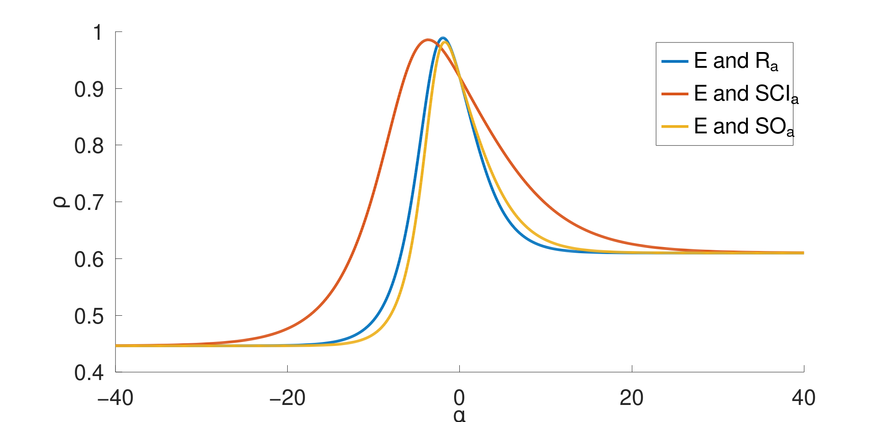

<h3>Files</h3>
<table>
  <tr><th>File Name</th><th>Description</th></tr>
  <tr><td><a href=01_combined_corr_curves.m>01_combined_corr_curves.m</a></td><td>Generates combined correlation curves plots, grouped by experimental data, for the 6 pairs of data, highlighting the curves' peaks and intersection between two curves with highest correlation in some given alpha</td></tr>
  <tr><td><a href=02_good_alpha_intervals.m>02_good_alpha_intervals.m</a></td><td>Generates 6 correlation curve plots, one for each pair of data, highlighting the alpha intervals which results in good correlation</td></tr>
  <tr><td><a href=03_scatter_plots.m>03_scatter_plots.m</a></td><td>Generates 6 scatter plots, one for each pair of data</td></tr>
  <tr><td><a href=GoldenSectionSearch_Maximum.m>GoldenSectionSearch_Maximum.m</a></td><td><b>IMPORTANT: This must be placed in the working directory as it is referenced in the <a href=01_combined_corr_curves.m>1<sup>st</sup></a> and <a href=03_scatter_plots.m>3<sup>rd</sup></a> scripts.</b> This is the Octave 7.2 implementation of the <a href="https://en.wikipedia.org/wiki/Golden-section_search">Golden Section Search</a> algorithm. I manually translated this from the <a href="https://en.wikipedia.org/wiki/Golden-section_search">Python code</a>.</td></tr>
</table>
<h3>Syntax</h3>
<p>The above scripts are to be run with the <a href=https://octave.org/>GNU Octave</a> software, not MATLAB. Due to some syntax differences between MATLAB and GNU Octave, e.g. in subsetting matrices/arrays, the scripts will not run (without ammendments) in MATLAB.</p>
<h3>Expected Output</h3>
<h4 align=center>Command Window output (<a href=01_combined_corr_curves.m>1<sup>st</sup> script</a>)</h4>

```
E against general_R
peakAlpha = -1.948205235815929
peakCorrCoeff = 0.989278272323736
E against general_SCI
peakAlpha = -3.662418922308818
peakCorrCoeff = 0.985744623747090
E against general_SO
peakAlpha = -1.728514071867182
peakCorrCoeff = 0.982031572039760
ΔH against general_R
peakAlpha = -1.238343021990512
peakCorrCoeff = 0.998062916158750
ΔH against general_SCI
peakAlpha = -2.355414572508679
peakCorrCoeff = 0.996731969127876
ΔH against general_SO
peakAlpha = -1.116549089101582
peakCorrCoeff = 0.995250875686022
```

<h4 align=center>Command Window output (<a href=01_combined_corr_curves.m>2<sup>nd</sup> script</a>)</h4>

```
ρ(E,R_α) ≥ 0.98 when α ∈ [-2.51104028, -1.33336651]
ρ(E,SCI_α) ≥ 0.98 when α ∈ [-4.49001912, -2.76422957]
ρ(E,SO_α) ≥ 0.98 when α ∈ [-1.96410112, -1.47970680]
ρ(ΔH,R_α) ≥ 0.99 when α ∈ [-1.83841258, -0.54993662]
ρ(ΔH,SCI_α) ≥ 0.99 when α ∈ [-3.39143100, -1.14804739]
ρ(ΔH,SO_α) ≥ 0.99 when α ∈ [-1.55591747, -0.60370869]
```

<table>
  <tr><th colspan=2>Combined correlation curves</th></tr>
  <tr>
    <td></td>
    <td></td>
  </tr>
  <tr>
    <td></td>
    <td></td>
  </tr>
</table>
<table>
  <tr><th colspan=3>Good alpha intervals</th></tr>
  <tr>
    <td></td>
    <td></td>
    <td></td>
  </tr>
  <tr>
    <td></td>
    <td></td>
    <td></td>
  </tr>
</table>
<table>
  <tr><th colspan=3>Scatter plots</th></tr>
  <tr>
    <td></td>
    <td></td>
    <td></td>
  </tr>
  <tr>
    <td></td>
    <td></td>
    <td></td>
  </tr>
</table>
