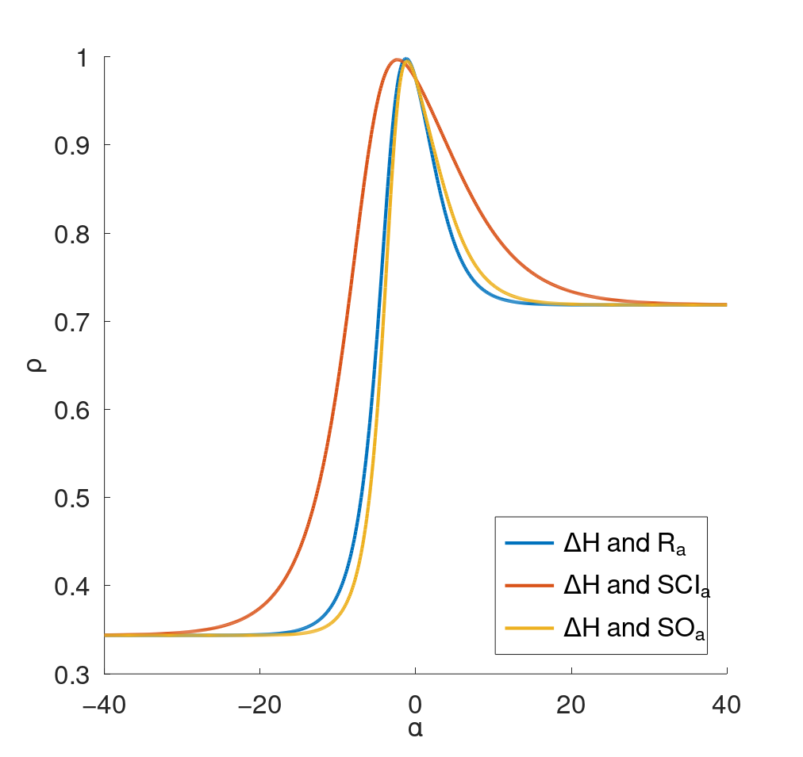
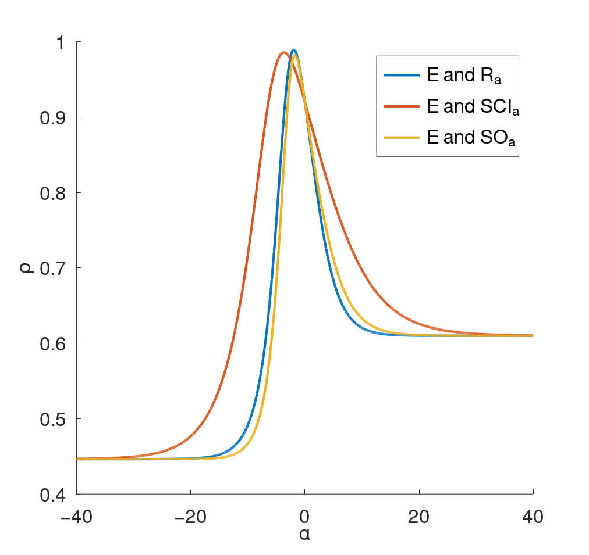
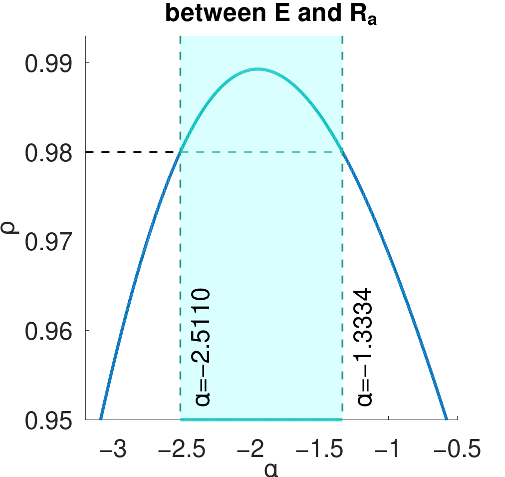

<h3>Files</h3>
<table>
  <tr><th>File Name</th><th>Description</th></tr>
  <tr><td>01_combined_corr_curves.m</td><td>Generates 4 combined plots for the correlation curves for the 6 pairs of data</td></tr>
  <tr><td>02_good_alpha_intervals.m</td><td>Generates 6 correlation curves, i.e., one for each pair of data, also indicating the alpha intervals which results in good correlation</td></tr>
  <tr><td>03_scatter_plots.m</td><td>Generates 6 scatter plots, one for each pair of data</td></tr>
  <tr><td>GoldenSectionSearch_Maximum.m</td><td>Octave 7.2 implementation of the <a href="https://en.wikipedia.org/wiki/Golden-section_search">Golden Section Search</a> algorithm. I manually translated this from the <a href="https://en.wikipedia.org/wiki/Golden-section_search">Python code</a>. This must be placed in the working directory as it is referenced in two of the other scripts.</td></tr>
</table>
<h3>Syntax</h3>

The above scripts are to be run in Octave. Due to some syntax differences between Matlab and Octave, e.g. in subsetting matrices/arrays, the scripts will not run (without ammendments) in Matlab.

<h3>Expected Output</h3>
<table>
  <tr><th colspan=6>Combined correlation curves</th></tr>
  <tr><td colspan=3></td><td colspan=3></td></tr>
  <tr><td colspan=3></td><td colspan=3></td></tr>
  <tr><th colspan=6>Good alpha intervals</th></tr>
  <tr><td></td><td></td><td></td><td></td><td></td><td></td></tr>
  <tr><th colspan=6>Scatter plots</th></tr>
  <tr><td></td><td></td><td></td><td></td><td></td><td></td></tr>
</table>
